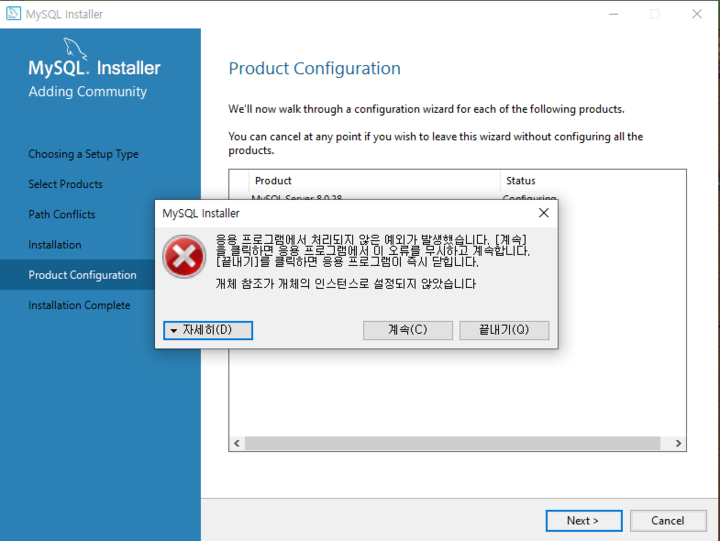

# 20230817 TIL

몇주전부터 mysql workbench로 로컬 db 생성해서 연결하는게 안돼서 팀원들과 같이 해결하려다 포기하고 프로젝트 진행할때 다른분 db를 같이 공유해서 진행했었는데... 이번 최종 프로젝트때도 그래야하나 싶어 새로운 팀원에게 상황을 공유했고 해결해보자해서 일단 mysql과 workbench를 삭제하고 다시 다운로드하려하는데

이 오류가 재설치 할때마다 계속 떴다! 전에 해결하려고 workdench 재설치 할때도 저 오류가 나왔는데 이번에도 떠서 다시 검색 모드에 들어갔다. 따로 캡쳐를 안해놨는데 파일 저장 경로가 뜰때 그 경로에 자꾸 문제가 생기는 것 같아 c드라이브에서 Program Files에있는 MySQL 파일만 삭제했었는데 자세히 보니 ProgramData파일에도 MySQL 파일이 남아있어 그것도 삭제 후 검색 결과

https://velog.io/@quitechoisen/MySQL-%EA%B9%A8%EB%81%97%ED%95%98%EA%B2%8C-%EC%82%AD%EC%A0%9C%ED%95%98%EA%B3%A0-%EC%9E%AC%EC%84%A4%EC%B9%98%ED%95%98%EB%8A%94-%EB%B0%A9%EB%B2%95-%EB%A7%9D%ED%95%A0-%EC%98%A4%EB%A5%98

이 블로그 마지막 방법인 레지스트리 편집기에서도 MySQL을 검색해 관련 파일을 모조리 삭제해버렸다.

그리고 팀원분이 공유해주신

https://velog.io/@bi-sz/MySQL-%EC%84%A4%EC%B9%98%ED%95%98%EA%B8%B0

이 블로그 따라서 천천히 처음부터 재설치를 했더니 재설치할때 어떤 오류도 뜨지 않았다! 설레는 마음으로 전에 했던 프로젝트를 열고 db 생성해 연결해보니 workbench도 정상적으로 연결이 되었다!!

이걸로 몇주를 고생했는데 ...도와주신 팀원들께 너무나 감사...😭
