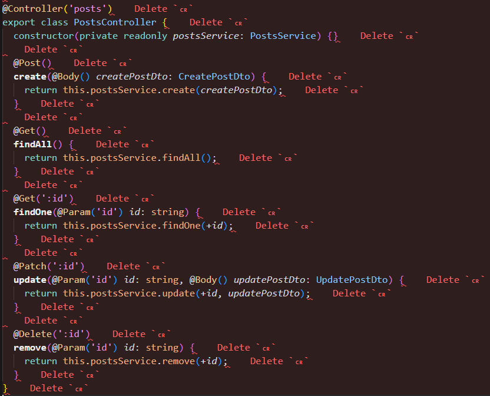

# 20230821 TIL

이제 최종프로젝트 맡은 부분 시작하려고 git pull 받고 코드를 전체적으로 보는데, (nest.js 사용)

이런식으로 dlelte cr 에러가 전체적으로 싹 다 떴다..

**문제의 원인**은 nest.js를 사용하면 eslint/prettier를 자동적으로 사용하게 되는데 nest.js를 cli로 생성하면 자동으로 설정되는 파일을 굳이 수정 할 필요는 없다. 하지만 delete cr이라는 에러가 생기는 경우가 있는데 window에서 발생하는 오류라고 한다.(prettier와 window의 개행방식에 차이에서 발생하는 것이라고 한다.)

**해결 방법**은 프로젝트 폴더 중 .eslintrc.js 파일에 코드 중 rules를 코드를 찾는다.

        rules: {
            '@typescript-eslint/interface-name-prefix': 'off',
            '@typescript-eslint/explicit-function-return-type': 'off',
            '@typescript-eslint/explicit-module-boundary-types': 'off',
            '@typescript-eslint/no-explicit-any': 'off',
        },

맨 하단에 코드를 추가한다.

        'prettier/prettier': ['error', { endOfLine: 'auto' }],

endOfLine 설정(= 행 끝에 사용할 줄 바꿈 문자를 설정한다)을 자동으로 감지하여 올바른 줄 바꿈 문자를 사용하도록 한다.

최종 코드

        rules: {
            '@typescript-eslint/interface-name-prefix': 'off',
            '@typescript-eslint/explicit-function-return-type': 'off',
            '@typescript-eslint/explicit-module-boundary-types': 'off',
            '@typescript-eslint/no-explicit-any': 'off',
            'prettier/prettier': ['error', { endOfLine: 'auto' }],
        },

이러고 다시 코드들을 확인해보면 깔끔하게 해결이 되어있다!
